# Análisis: Tasa de Ganancia y Stock de Capital — Sector Hidrocarburos Argentina

_Generado: 2026-05-25_

---

## Datos utilizados

- **Fuente**: `renta_de_la_tierra_hidrocarburifera_arg.xlsx`
- **Hojas analizadas**: `tg_pg_total` y `stock_empresas`
- **Período tg\_pg\_total**: 1993–2026
- **Período stock\_empresas**: 1992–2026
- **Unidad de origen**: Millones de pesos corrientes
- **Conversiones presentadas**:
  - Pesos constantes 2018: `valor / ipc_18` (ipc_18 rebased 2018 = 1)
  - USD TCC: `valor / tcc` (tipo de cambio comercial)
  - USD TCP: `valor / tcp` (tipo de cambio de paridad)

### Cobertura de fuentes en stock_empresas (variable ppye)

| Fuente | Empresas | Desde | Hasta |
| --- | --- | --- | --- |
| Bolsar | 8 | 1997 | 2018 |
| S&P Capital IQ | 15 | 1995 | 2026 |

---

## 1. Tasa de Ganancia por fuente de stock (`tg_pg_total`)

### Descripción

La hoja `tg_pg_total` calcula la **tasa de ganancia sectorial** como `tg = EBE / ppye`.
El EBE (Excedente Bruto de Explotación) proviene del Criterio propio (precios internacionales)
y es único para todos los años. El **stock de capital (ppye)** varía según la fuente: AFIP (combinada), AFIP (nuevo), AFIP (v8), Bolsar, S&P Capital IQ.
Comparar las tasas de ganancia entre fuentes permite evaluar la sensibilidad del resultado
a la elección del stock de capital.

### Estadísticas por fuente

| Fuente | TG media | TG máxima | Año del máximo | TG en 2025 | Período |
| --- | --- | --- | --- | --- | --- |
| AFIP (combinada) | 1.454 | 4.293 | 2020 |  | 2001–2022 |
| AFIP (nuevo) | 1.451 | 4.293 | 2020 |  | 2014–2022 |
| AFIP (v8) | 1.596 | 3.417 | 2014 |  | 2001–2014 |
| Bolsar | 1.195 | 2.529 | 2012 |  | 1998–2018 |
| S&P Capital IQ | 0.588 | 2.844 | 2004 | 0.278 | 1998–2025 |

### Insights

- La fuente **AFIP (v8)** produce la mayor tasa de ganancia promedio (1.596), mientras que **S&P Capital IQ** produce la menor (0.588). Esta diferencia se explica principalmente por el tamaño del stock de capital (ppye) usado como denominador.
- El máximo histórico fue registrado con la fuente **AFIP (combinada)** en 2020 (tg = 4.293).

### Gráficos

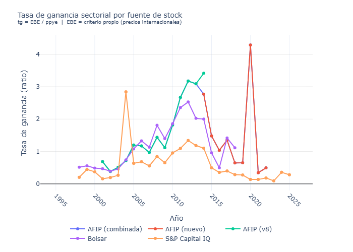

_Figura 1: Tasa de ganancia sectorial por fuente de stock de capital._

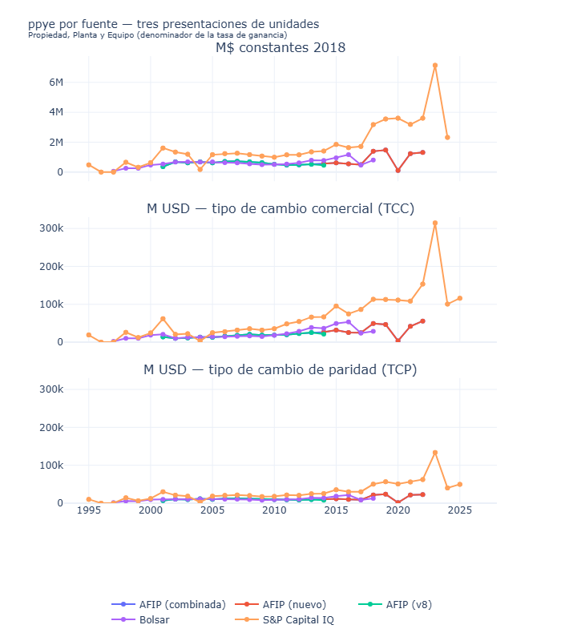

_Figura 2: ppye (denominador de la tasa de ganancia) por fuente en pesos constantes 2018, USD TCC y USD TCP._

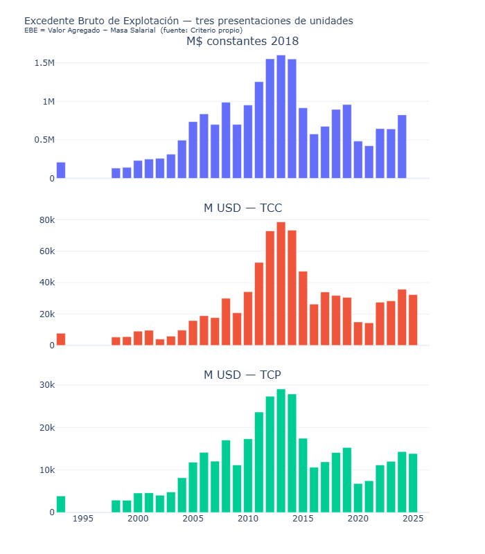

_Figura 3: Excedente Bruto de Explotación en tres unidades._

---

## 2. Stock de Capital por Empresa (`stock_empresas`)

### Descripción

La hoja `stock_empresas` contiene activos y resultados de empresas del sector en formato largo.
Variables disponibles: `KTA`, `ppye`, `ppye_neta`, `inventarios`, `activo_no_corr`, `activo`,
`gcia_ant`, `gcia_desp`, `tg_ant`, `tg_desp`.
El análisis se focaliza en **ppye** (denominador de la tasa de ganancia) y en las
**tasas de ganancia por empresa y sector** derivadas directamente de los balances.

### Insights

- **Bolsar (2018)**: empresa con mayor ppye: **YPF**. Participación de YPF en el total: **81.4%**.
- **S&P Capital IQ (2024)**: empresa con mayor ppye: **YPF**. Participación de YPF en el total: **52.2%**.
- En 2018 (último año con cobertura simultánea), el stock agregado de **S&P Capital IQ** es **3.75x mayor** que el de **Bolsar** (pesos constantes 2018), lo que implica tasas de ganancia menores al usar S&P Capital IQ.

### Gráficos

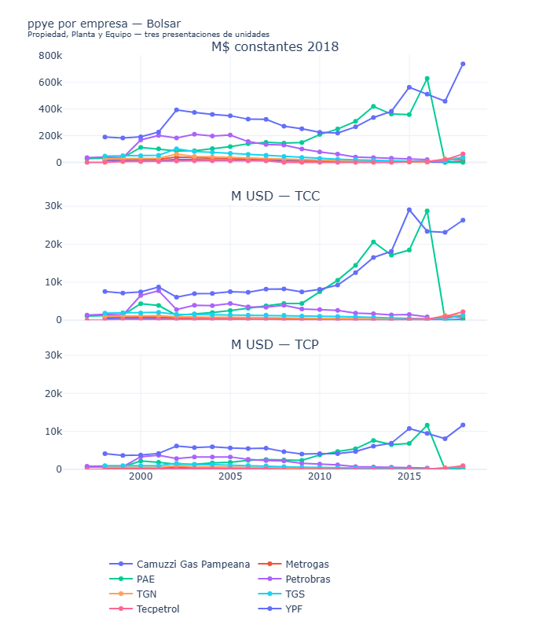

_Figura 4: ppye por empresa — Bolsar, en pesos constantes 2018, USD TCC y USD TCP (TCC/TCP comparten escala)._

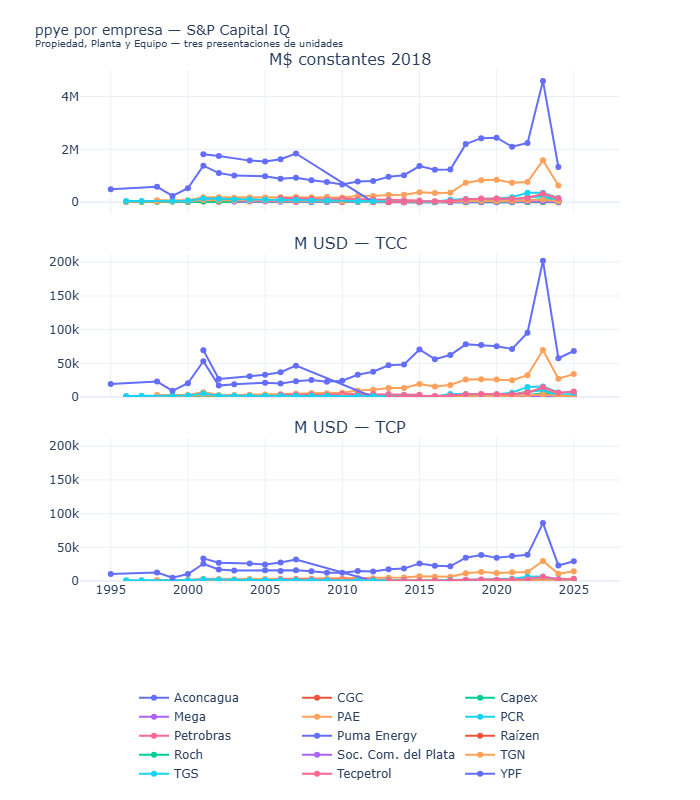

_Figura 5: ppye por empresa — S&P Capital IQ, mismas tres unidades._

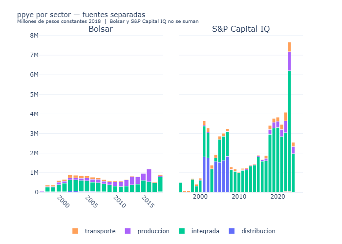

_Figura 6: ppye por sector — Bolsar y S&P Capital IQ en subgráficos separados (no se suman). M$ constantes 2018._

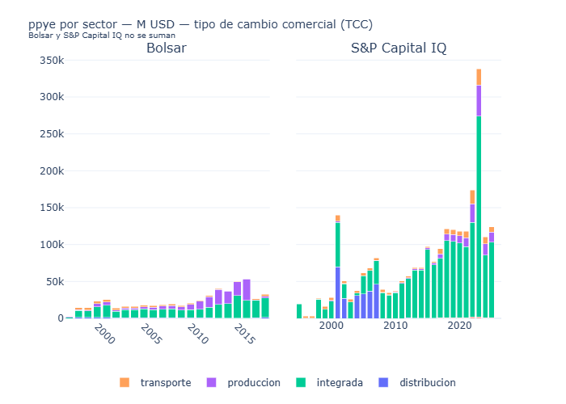

_Figura 6b: ppye por sector en USD tipo de cambio comercial (TCC)._

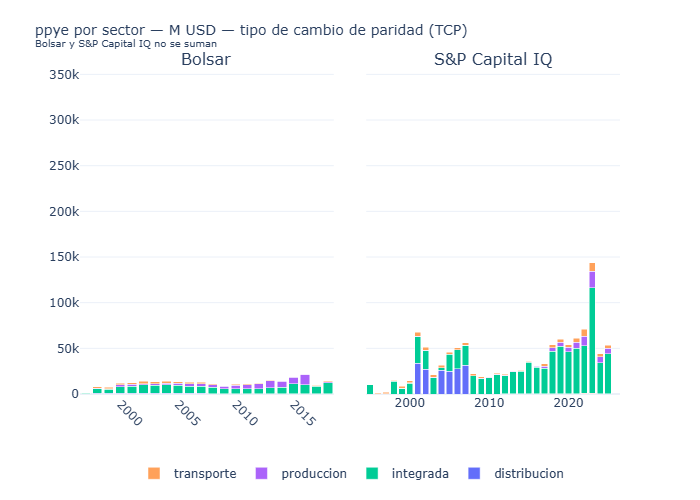

_Figura 6c: ppye por sector en USD tipo de cambio de paridad (TCP). Misma escala que 6b._

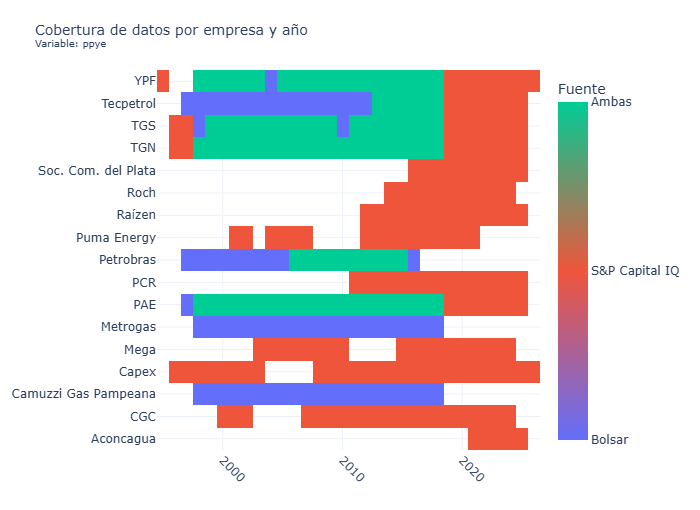

_Figura 7: Cobertura de datos — qué empresa y año están cubiertos por cada fuente._

### Tasa de ganancia por empresa (desde balances)

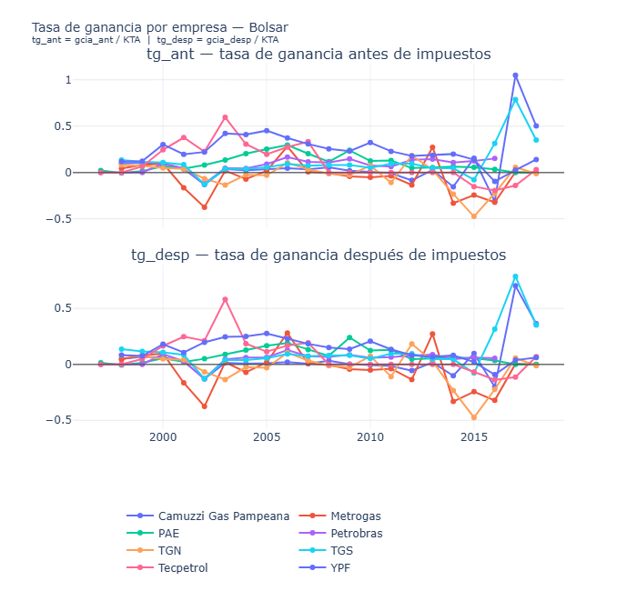

_Figura 8: tg\_ant y tg\_desp por empresa — Bolsar. tg = gcia / KTA, dos paneles (antes y después de impuestos)._

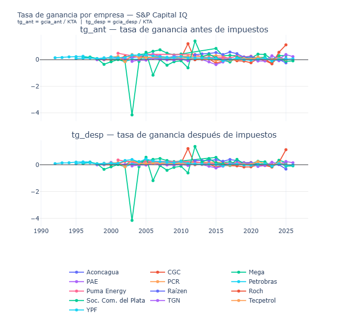

_Figura 9: tg\_ant y tg\_desp por empresa — S&P Capital IQ._

### Tasa de ganancia sectorial (desde balances)

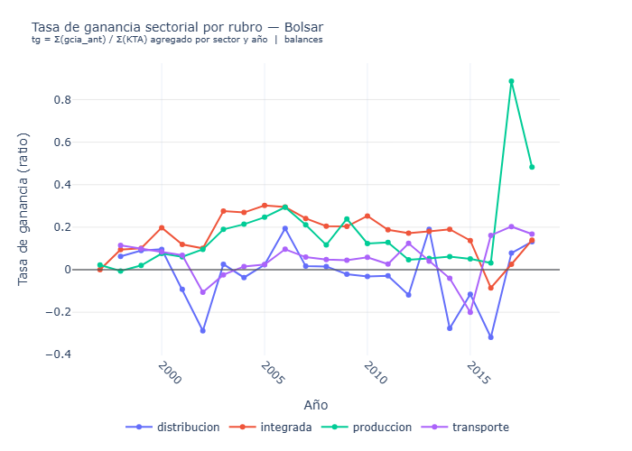

_Figura 10: tg sectorial — Bolsar. tg = Σ(gcia\_ant) / Σ(KTA) por sector y año._

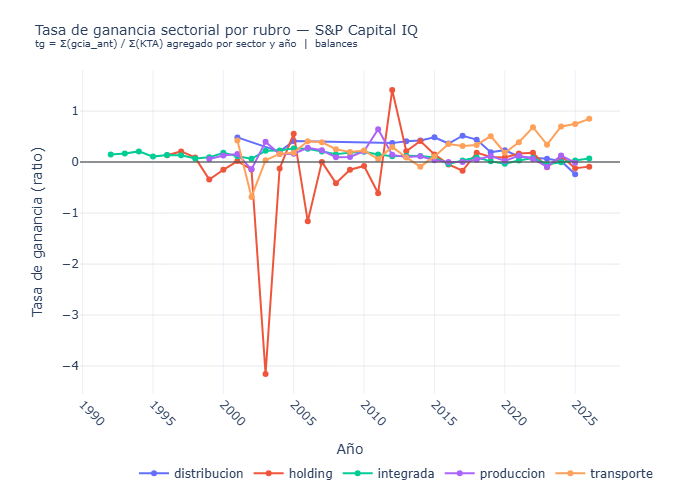

_Figura 11: tg sectorial — S&P Capital IQ._

---

## 3. Renta total por fuente de stock (`RTPG_multifuente`)

### Descripción

La hoja `RTPG_multifuente` replica el cálculo de renta indirecta (suma de mecanismos) para **cada fuente de stock disponible**. Todos los componentes son idénticos entre fuentes, excepto `renta_empresas = ppye × (tg_hc − tg_normal)`, que depende del tamaño del stock de capital seleccionado.

### Insights

- En 2025, la renta total estimada varía entre **M USD 14,631** (AFIP (combinada)) y **M USD 14,631** (AFIP (combinada)), una brecha de **M USD 0**.
- La diferencia entre fuentes se explica exclusivamente por `renta_empresas` (`ppye × (tg_hc − tg_normal)`): un stock de capital mayor implica mayor ppye y por ende mayor renta apropiada por las empresas.

### Gráficos

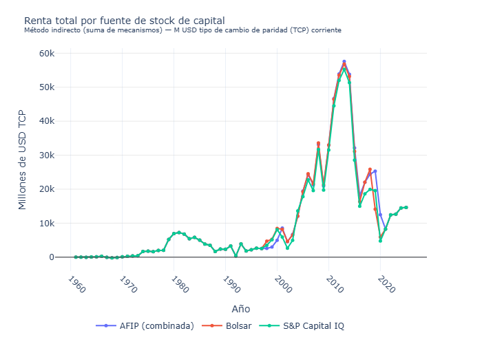

_Figura 14: Renta total (M USD TCP) por fuente de stock._

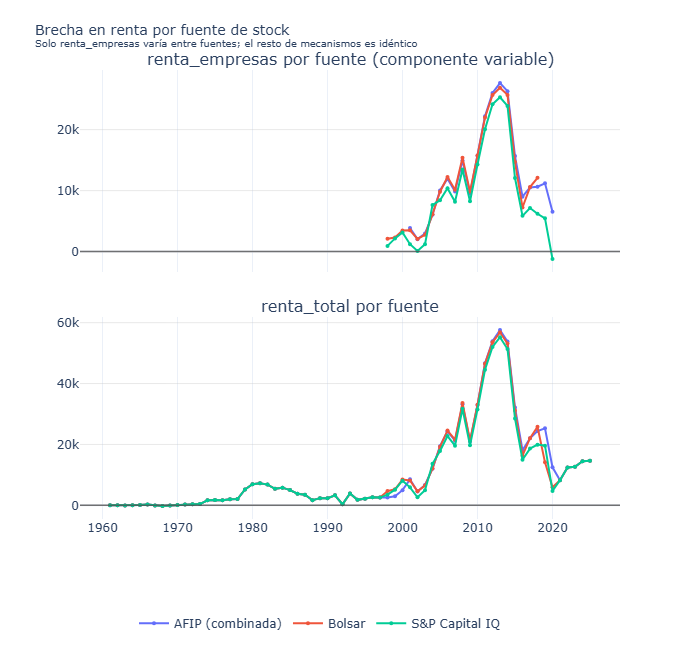

_Figura 15: renta\_empresas (componente variable) y renta\_total en dos paneles, comparados por fuente._

---

## Conclusiones

- La elección de la fuente de stock de capital es determinante para el cálculo de la tasa de ganancia sectorial. Las diferencias entre Bolsar, S&P Capital IQ y AFIP no son sólo técnicas: reflejan distintos universos de empresas, períodos de cobertura y criterios de valuación contable.
- Para el cálculo de renta de la tierra es recomendable presentar los resultados bajo las distintas fuentes como **bandas de incertidumbre**, en lugar de una estimación puntual.
- La fuente **AFIP (v8)** produce sistemáticamente las tasas de ganancia más altas, lo que indica un stock de capital (ppye) más pequeño que el de **S&P Capital IQ**. Usar **AFIP (v8)** como denominador sobreestima la tasa de ganancia y, por ende, la renta apropiada por las empresas, en comparación con usar **S&P Capital IQ**.